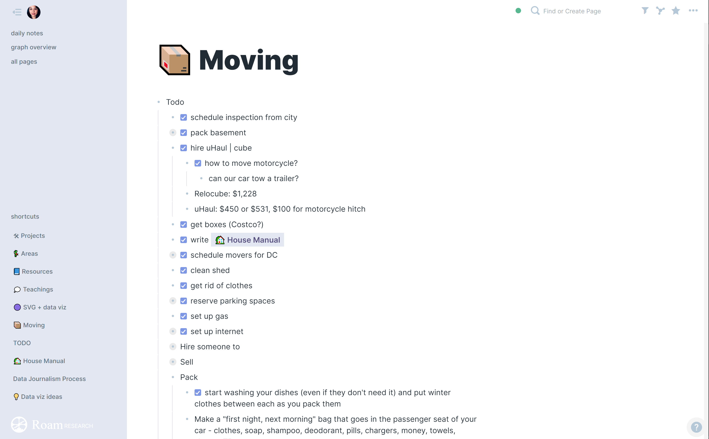

# Theme for Roam

Feel free to use as you like. One option is to upload the `style.css` text into a browser extension that adds custom css per domain, like [Amino](https://chrome.google.com/webstore/detail/amino-live-css-editor/pbcpfbcibpcbfbmddogfhcijfpboeaaf?hl=en-US)
